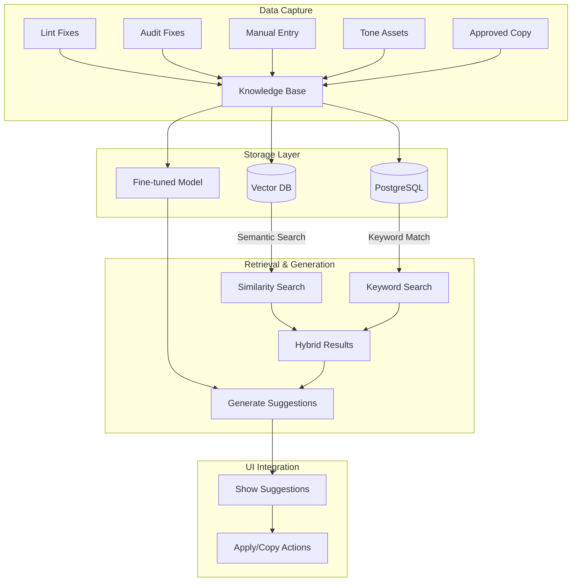

# Brand LLM Knowledge Base Implementat

ion

## Overview

Build a per-brand knowledge base that learns from approved copy, fixes, and tone assets. Use vector embeddings for semantic similarity search and fine-tuned LLM for brand-consistent generation. Surface suggestions like "You have used similar copy before" with apply/copy actions.

## Architecture




## Database Schema Changes

### New Models

**`ApprovedCopy` model** - Stores approved copy snippets per brand:

- `id`, `brandId`, `text` (the approved copy)
- `source` (FIXED_FROM_LINT, FIXED_FROM_AUDIT, MANUAL_ENTRY, TONE_ASSET)
- `sourceId` (reference to Finding/AuditIssue/ManualEntry)
- `context` (ui, marketing, support)
- `surface`, `channel`, `locale`
- `tags` (string array for categorization)
- `metadata` (JSON for additional info)
- `embedding` (vector for semantic search)
- `approvedBy`, `approvedAt`
- `usageCount` (track how often it's suggested/applied)

**`BrandLLMModel` model** - Tracks fine-tuned model versions:

- `id`, `brandId`, `version`
- `modelId` (OpenAI fine-tuned model ID)
- `trainingDataCount`, `status` (TRAINING, READY, FAILED)
- `createdAt`, `trainedAt`

**`CopySuggestion` model** - Tracks when suggestions are shown/applied:

- `id`, `brandId`, `approvedCopyId`
- `suggestedFor` (text that triggered suggestion)
- `similarityScore`, `matchType` (SEMANTIC, KEYWORD, HYBRID)
- `applied` (boolean), `appliedAt`
- `context` (where it was suggested: lint, audit, rewrite)

### Schema Updates

Add to `Finding`:

- `approvedCopyId` (nullable, when fix becomes approved copy)

Add to `AuditIssue`:

- `approvedCopyId` (nullable, when fix becomes approved copy)

Add to `Brand`:

- `approvedCopies` relation
- `brandLLMModels` relation

## Implementation Steps

### Phase 1: Data Capture & Storage

#### 1.1 Database Migration

- Create `ApprovedCopy`, `BrandLLMModel`, `CopySuggestion` models
- Add `pgvector` extension for vector storage
- Add indexes for efficient search
- Update existing models with relations

**Files:**

- `prisma/schema.prisma` - Add new models
- Migration file for schema changes

#### 1.2 Auto-Capture Service

Create service to automatically capture approved fixes:**`lib/brand-llm/capture.ts`**:

- `captureFromFinding(findingId, approvedBy)` - When Finding is marked as approved
- `captureFromAuditIssue(issueId, approvedBy)` - When AuditIssue is marked as FIXED
- `captureFromRewrite(rewriteResult, approvedBy)` - When user accepts rewrite output
- Extract text, context, metadata
- Generate embeddings using OpenAI embeddings API
- Store in `ApprovedCopy` table

**Integration points:**

- `app/api/brands/[brandId]/lint/route.ts` - After creating Finding, check if user approves
- `app/api/brands/[brandId]/audit/[auditId]/route.ts` - When issue marked FIXED
- `components/editor/editor-panel.tsx` - Add "Approve this fix" button
- `components/audit/audit-issue-detail.tsx` - Add "Approve fix" when marking FIXED

#### 1.3 Manual Entry UI

Create UI for manually adding approved copy:**`app/brands/[brandId]/approved-copy/page.tsx`**:

- List all approved copy snippets
- Add new snippet form
- Edit/delete existing snippets
- Filter by context, surface, tags
- Bulk import from CSV/JSON

**`app/api/brands/[brandId]/approved-copy/route.ts`**:

- `GET` - List approved copy with filters
- `POST` - Create new approved copy
- `PATCH` - Update approved copy
- `DELETE` - Remove approved copy

**Components:**

- `components/approved-copy/approved-copy-list.tsx`
- `components/approved-copy/approved-copy-form.tsx`
- `components/approved-copy/approved-copy-card.tsx`

### Phase 2: Vector Embeddings & Search

#### 2.1 Embedding Generation

**`lib/brand-llm/embeddings.ts`**:

- `generateEmbedding(text)` - Call OpenAI embeddings API
- `batchGenerateEmbeddings(texts)` - Batch processing
- `updateEmbedding(approvedCopyId)` - Regenerate if text changes

**Dependencies:**

- Install `pgvector` package for PostgreSQL vector support
- Configure PostgreSQL with pgvector extension

#### 2.2 Similarity Search Service

**`lib/brand-llm/search.ts`**:

- `findSimilarCopy(brandId, queryText, options)` - Hybrid search
- Semantic: Vector similarity using cosine distance
- Keyword: Full-text search on text field
- Combine with weighted scoring
- `findByKeywords(brandId, keywords)` - Exact/keyword matching
- `findBySemantic(brandId, queryText, threshold)` - Vector similarity only

**Search options:**

- `context` filter (ui, marketing, support)
- `surface` filter
- `minSimilarity` threshold (0-1)
- `limit` results count
- `matchType` preference (SEMANTIC, KEYWORD, HYBRID)

#### 2.3 API Endpoints

**`app/api/brands/[brandId]/approved-copy/search/route.ts`**:

- `POST` - Search for similar copy
- Accepts query text, filters, options
- Returns ranked results with similarity scores

### Phase 3: Fine-Tuning Pipeline

#### 3.1 Training Data Preparation

**`lib/brand-llm/training-data.ts`**:

- `prepareTrainingData(brandId)` - Collect all approved copy
- Format for OpenAI fine-tuning (JSONL)
- Include context, examples, tone guidelines
- Generate prompt-completion pairs

#### 3.2 Fine-Tuning Service

**`lib/brand-llm/fine-tuning.ts`**:

- `createFineTuneJob(brandId)` - Submit to OpenAI
- `checkFineTuneStatus(jobId)` - Poll for completion
- `getFineTunedModel(jobId)` - Retrieve model ID
- Store model info in `BrandLLMModel`

**API Endpoints:**

- `app/api/brands/[brandId]/llm/train/route.ts` - Start training
- `app/api/brands/[brandId]/llm/status/route.ts` - Check status
- `app/api/brands/[brandId]/llm/models/route.ts` - List models

#### 3.3 Model Usage

**`lib/brand-llm/generate.ts`**:

- `generateWithBrandLLM(brandId, prompt, options)` - Use fine-tuned model
- Fallback to base model if no fine-tuned model available
- Include approved copy examples in context

### Phase 4: UI Integration

#### 4.1 Suggestion Component

**`components/brand-llm/copy-suggestion.tsx`**:

- Display "You have used similar copy before" message
- Show matched copy with similarity score
- "Apply" button - replaces current text
- "Copy" button - copies to clipboard
- "View source" link - shows where it came from

#### 4.2 Integration in Editor

**`components/editor/editor-panel.tsx`**:

- After lint/rewrite, search for similar approved copy
- Show suggestions below issues/changes
- Allow applying suggestions inline

#### 4.3 Integration in Audit

**`components/audit/audit-issue-detail.tsx`**:

- When showing suggested fix, also show similar approved copy
- Allow applying approved copy instead of AI suggestion

#### 4.4 Integration in Rewrite

**`app/api/brands/[brandId]/rewrite/route.ts`**:

- Before/after rewrite, search for similar approved copy
- Include approved copy examples in prompt context
- Use fine-tuned model if available

### Phase 5: Learning & Improvement

#### 5.1 Usage Tracking

**`lib/brand-llm/tracking.ts`**:

- Track when suggestions are shown (`CopySuggestion`)
- Track when suggestions are applied
- Track when approved copy is used
- Update `usageCount` on `ApprovedCopy`

#### 5.2 Quality Metrics

- Similarity score distribution
- Apply rate (suggestions applied / shown)
- Most used approved copy
- Context-specific performance

#### 5.3 Auto-Improvement

- Retrain model periodically as approved copy grows
- Adjust similarity thresholds based on apply rates
- Surface underused approved copy for review

## Technical Details

### Vector Storage

- Use `pgvector` PostgreSQL extension
- Store embeddings as `vector(1536)` (OpenAI ada-002 dimension)
- Create index: `CREATE INDEX ON approved_copy USING ivfflat (embedding vector_cosine_ops);`

### Embedding Model

- Use OpenAI `text-embedding-ada-002` (or `text-embedding-3-small` for better performance)
- Batch requests for efficiency
- Cache embeddings to avoid regeneration

### Fine-Tuning

- Use OpenAI fine-tuning API
- Format: prompt-completion pairs from approved copy
- Include brand rules and tone guidelines in prompts
- Minimum 10 examples, recommend 50+ for quality

### Hybrid Search Algorithm

```typescript
function hybridSearch(semanticResults, keywordResults) {
  // Normalize scores to 0-1
  const semanticScore = normalize(semanticResults.similarity);
  const keywordScore = normalize(keywordResults.relevance);
  
  // Weighted combination (70% semantic, 30% keyword)
  const combinedScore = (0.7 * semanticScore) + (0.3 * keywordScore);
  
  // Merge and deduplicate results
  return mergeResults(semanticResults, keywordResults, combinedScore);
}
```


## File Structure

```javascript
lib/brand-llm/
  ├── capture.ts          # Auto-capture from fixes
  ├── embeddings.ts       # Generate and store embeddings
  ├── search.ts           # Similarity search (hybrid)
  ├── fine-tuning.ts      # Fine-tune model pipeline
  ├── generate.ts         # Generate with brand LLM
  └── tracking.ts         # Usage tracking

app/brands/[brandId]/approved-copy/
  ├── page.tsx            # List/manage approved copy
  └── [id]/page.tsx       # Edit approved copy

app/api/brands/[brandId]/approved-copy/
  ├── route.ts            # CRUD operations
  ├── search/route.ts     # Search endpoint
  └── [id]/route.ts       # Individual copy operations

app/api/brands/[brandId]/llm/
  ├── train/route.ts      # Start fine-tuning
  ├── status/route.ts     # Check training status
  └── models/route.ts     # List models

components/brand-llm/
  ├── copy-suggestion.tsx # Suggestion UI component
  ├── approved-copy-list.tsx
  ├── approved-copy-form.tsx
  └── approved-copy-card.tsx
```


## Dependencies

- `pgvector` - PostgreSQL vector extension
- `@prisma/client` - Already installed
- OpenAI API - Already installed
- Consider `@pinecone-database/pinecone` or `qdrant` for production scale

## Migration Strategy

1. **Phase 1** (MVP): Vector embeddings + hybrid search only
2. **Phase 2**: Add fine-tuning when enough data (50+ approved copy entries)
3. **Phase 3**: Advanced features (auto-retraining, quality metrics)

## Success Metrics

- Apply rate > 30% (suggestions applied / shown)